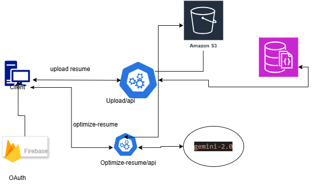

# Resume Optimization API

Node.js and TypeScript API for resume upload, text extraction, AI-driven optimization, and storage integration.

## Overview

This repository contains the backend for the Resume Optimization application. It handles:

- authenticated resume uploads
- PDF and DOC/DOCX text extraction
- AI-assisted resume analysis and optimization
- S3 storage integration
- Firebase-based authentication
- request rate limiting and security middleware

## Project Diagram

### Resume Optimization Application Architecture


## Architecture

- `src/controllers` - HTTP request handlers
- `src/services` - business logic and external integrations
- `src/middleware` - auth, rate limiting, and upload handling
- `src/config` - database, Firebase, and S3 configuration
- `src/model` - persistence models
- `src/route` - route registration
- `src/utils` - shared helpers
- `tests` - unit test coverage and mocks

## Requirements

- Node.js 16 or newer
- npm

## Setup

1. Install dependencies:

   ```bash
   npm install
   ```

2. Configure environment variables in `.env`.

3. Start the development server:

   ```bash
   npm run dev
   ```

## Available Scripts

- `npm run dev` - start the API with auto-reload
- `npm run build` - compile TypeScript to `dist`
- `npm start` - run the compiled server from `dist`
- `npm run lint` - run ESLint across `src` and `tests`
- `npm run lint:fix` - automatically fix lint issues where possible
- `npm test` - run the full Jest test suite
- `npm run test:unit` - run unit tests only
- `npm run test:integration` - run integration tests only
- `npm run test:coverage` - generate coverage reports

## Testing and Quality

This repository now includes ESLint-based linting alongside Jest tests. Run these before opening a pull request:

```bash
npm run lint
npm test
npm run build
```

## Notes

- Uploaded files and generated artifacts are excluded from source control.
- The repository is currently backend-only; frontend concerns are handled elsewhere.
